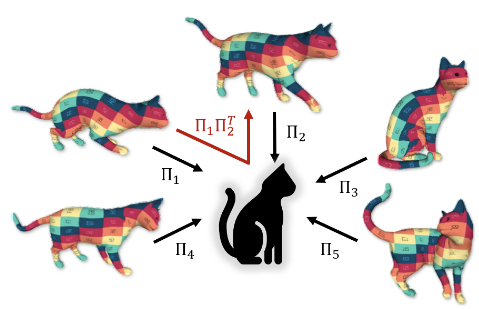

{{ page.authors }}

## Abstract

> 3D shape matching is a long-standing problem in computer vision and computer graphics. While deep neural networks were shown to lead to state-of-the-art results in shape matching, existing learning-based approaches are limited in the context of multi-shape matching: (i) either they focus on matching pairs of shapes only and thus suffer from cycle-inconsistent multi-matchings, or (ii) they require an explicit template shape to address the matching of a collection of shapes. In this paper, we present a novel approach for deep multi-shape matching that ensures cycle-consistent multi-matchings while not depending on an explicit template shape. To this end, we utilise a shape-to-universe multi-matching representation that we combine with powerful functional map regularisation, so that our multi-shape matching neural network can be trained in a fully unsupervised manner. While the functional map regularisation is only considered during training time, functional maps are not computed for predicting correspondences, thereby allowing for fast inference. We demonstrate that our method achieves state-of-the-art results on several challenging benchmark datasets, and, most remarkably, that our unsupervised method even outperforms recent supervised methods.

## Resources

<a href=" {{ page.paperurl }} ">[pdf]</a> <a href=" {{ page.arxiv }} ">[arxiv]</a> <a href=" {{ page.code }} ">[github]</a> <a href=" {{ page.pageurl }} ">[project page]</a> <a href=" {{ page.video }} ">[video]</a> <a href=" {{ page.poster }} ">[poster]</a>

## Bibtex

    @inproceedings{cao2022,
    title = {Unsupervised Deep Multi-Shape Matching},
    author = {D. Cao and F. Bernard},
    year  = {2022},
    booktitle = {European Conference on Computer Vision (ECCV)}
    }
