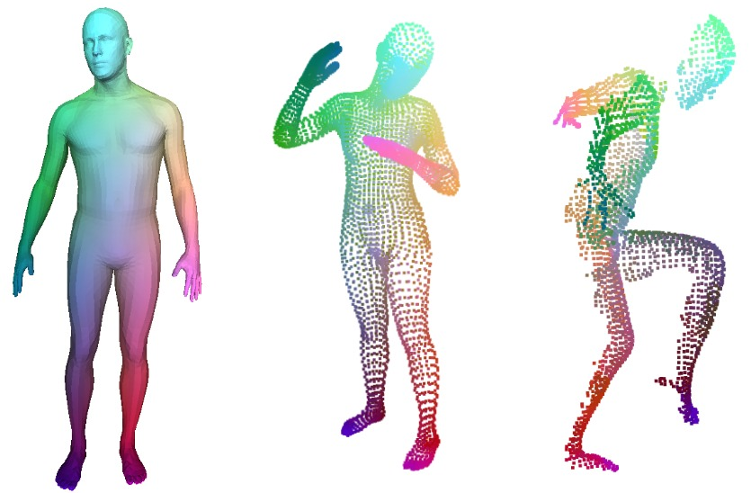

<!-- {{ page.authors }} -->

    <a href=" {{ site.data.authors[author].url }} ">{{ site.data.authors[author].name }}</a>
    , 


## Abstract

> The matching of 3D shapes has been extensively studied for shapes represented as surface meshes, as well as for shapes represented as point clouds. While point clouds are a common representation of raw real-world 3D data (e.g. from laser scanners), meshes encode rich and expressive topological information, but their creation typically requires some form of (often manual) curation. In turn, methods that purely rely on point clouds are unable to meet the matching quality of mesh-based methods that utilise the additional topological structure. In this work we close this gap by introducing a self-supervised multimodal learning strategy that combines mesh-based functional map regularisation with a contrastive loss that couples mesh and point cloud data. Our shape matching approach allows to obtain intramodal correspondences for triangle meshes, complete point clouds, and partially observed point clouds, as well as correspondences across these data modalities. We demonstrate that our method achieves state-of-the-art results on several challenging benchmark datasets even in comparison to recent supervised methods, and that our method reaches previously unseen cross-dataset generalisation ability.

## Resources

<a href=" {{ page.paperurl }} ">[pdf]</a> <a href=" {{ page.arxiv }} ">[arxiv]</a> <a href=" {{ page.code }} ">[github]</a> <a href=" {{ page.pageurl }} ">[project page]</a> <a href=" {{ page.video }} ">[video]</a> <a href=" {{ page.poster }} ">[poster]</a>

## Bibtex

    @InProceedings{Cao_2023_CVPR,
        author    = {Cao, Dongliang and Bernard, Florian},
        title     = {Self-Supervised Learning for Multimodal Non-Rigid 3D Shape Matching},
        booktitle = {Proceedings of the IEEE/CVF Conference on Computer Vision and Pattern Recognition (CVPR)},
        month     = {June},
        year      = {2023}
    }  
