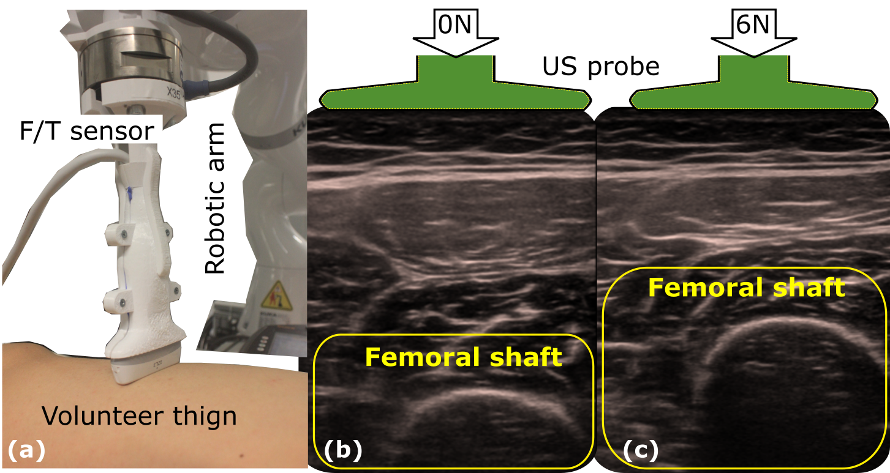

<!-- {{ page.authors }} -->

    <a href=" {{ site.data.authors[author].url }} ">{{ site.data.authors[author].name }}</a>
    , 


## Abstract

> The recovery of morphologically accurate anatomical images from deformed ones is challenging in ultrasound (US) image acquisition, but crucial to accurate and consistent diagnosis, particularly in the emerging field of computer-assisted diagnosis. This article presents a novel anatomy-aware deformation correction approach based on a coarse-to-fine, multi-scale deep neural network (DefCor-Net). To achieve pixel-wise performance, DefCor-Net incorporates biomedical knowledge by estimating pixel-wise stiffness online using a U-shaped feature extractor. The deformation field is then computed using polynomial regression by integrating the measured force applied by the US probe. Based on real-time estimation of pixel-by-pixel tissue properties, the learning-based approach enables the potential for anatomy-aware deformation correction. To demonstrate the effectiveness of the proposed DefCor-Net, images recorded at multiple locations on forearms and upper arms of six volunteers are used to train and validate DefCor-Net. The results demonstrate that DefCor-Net can significantly improve the accuracy of deformation correction to recover the original geometry (Dice Coefficient: from 14.3±20.9 to 82.6±12.1 when the force is 6N).
## Resources

<a href=" {{ page.paperurl }} ">[pdf]</a> <a href=" {{ page.arxiv }} ">[arxiv]</a> <a href=" {{ page.code }} ">[github]</a> <a href=" {{ page.pageurl }} ">[project page]</a> <a href=" {{ page.video }} ">[video]</a> <a href=" {{ page.poster }} ">[poster]</a>

## Bibtex

    @article{jiang2023defcor,
        title={DefCor-Net: Physics-aware ultrasound deformation correction},
        author={Jiang, Zhongliang and Zhou, Yue and Cao, Dongliang and Navab, Nassir},
        journal={Medical Image Analysis},
        pages={102923},
        year={2023},
        publisher={Elsevier}
    }