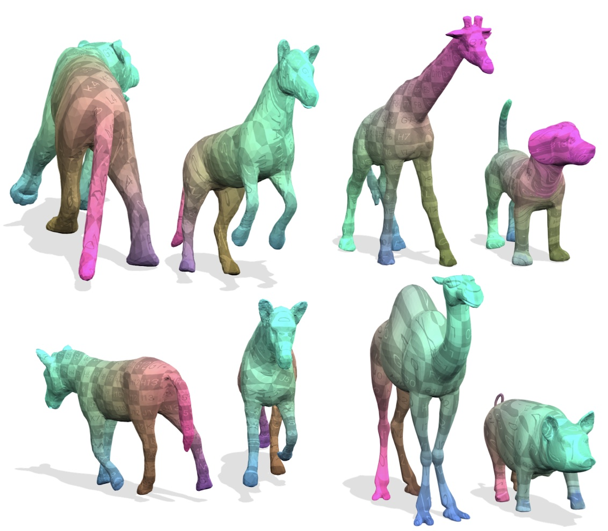

{{ page.authors }}

## Abstract

> We propose a novel learning-based approach for robust 3D shape matching. Our method builds upon deep functional maps and can be trained in a fully unsupervised manner. Previous deep functional map methods mainly focus on predicting optimised functional maps alone, and then rely on off-the-shelf post-processing to obtain accurate point-wise maps during inference. However, this two-stage procedure for obtaining point-wise maps often yields sub-optimal performance. In contrast, building upon recent insights about the relation between functional maps and point-wise maps, we propose a novel unsupervised loss to couple the functional maps and point-wise maps, and thereby directly obtain point-wise maps without any post-processing. Our approach obtains accurate correspondences not only for near-isometric shapes, but also for more challenging non-isometric shapes and partial shapes, as well as shapes with different discretisation or topological noise. Using a total of nine diverse datasets, we extensively evaluate the performance and demonstrate that our method substantially outperforms previous stateof-the-art methods, even compared to recent supervised methods.

## Resources

<a href=" {{ page.paperurl }} ">[pdf]</a> <a href=" {{ page.arxiv }} ">[arxiv]</a> <a href=" {{ page.code }} ">[github]</a> <a href=" {{ page.pageurl }} ">[project page]</a> <a href=" {{ page.video }} ">[video]</a> <a href=" {{ page.poster }} ">[poster]</a>

## Bibtex

    @article{cao2023unsupervised,
      title={Unsupervised Learning of Robust Spectral Shape Matching}, 
      author={Dongliang Cao and Paul Roetzer and Florian Bernard},
      journal = {ACM Transactions on Graphics (TOG)},
      year = {2023},
      publisher = {ACM New York, NY, USA},
      doi = {10.1145/3592107},
      url = {https://doi.org/10.1145/3592107}
    }
