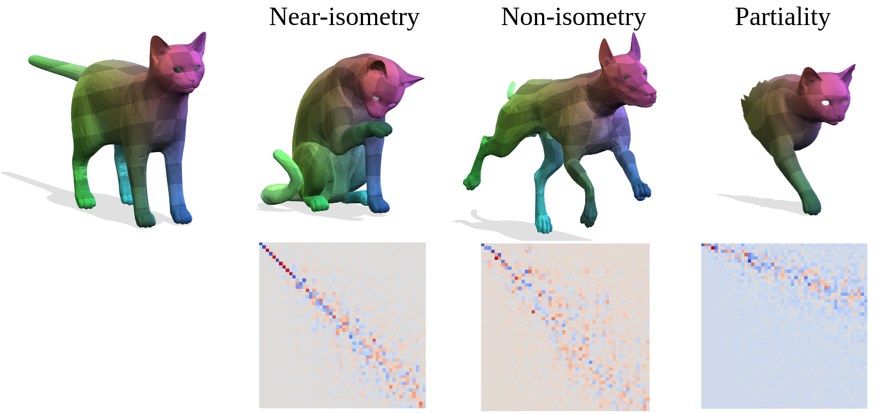

{{ page.authors }}

## Abstract

> We propose a novel unsupervised learning approach for non-rigid 3D shape matching. Our approach improves upon recent state-of-the art deep functional map methods and can be applied to a broad range of different challenging scenarios. Previous deep functional map methods mainly focus on feature extraction and aim exclusively at obtaining more expressive features for functional map computation. However, the importance of the functional map computation itself is often neglected and the relationship between the functional map and point-wise map is underexplored. In this paper, we systematically investigate the coupling relationship between the functional map from the functional map solver and the point-wise map based on feature similarity. To this end, we propose a self-adaptive functional map solver to adjust the functional map regularisation for different shape matching scenarios, together with a vertex-wise contrastive loss to obtain more discriminative features. Using different challenging datasets (including non-isometry, topological noise and partiality), we demonstrate that our method substantially outperforms previous state-of-the-art methods.

## Resources

<a href=" {{ page.paperurl }} ">[pdf]</a> <a href=" {{ page.arxiv }} ">[arxiv]</a> <a href=" {{ page.code }} ">[github]</a> <a href=" {{ page.pageurl }} ">[project page]</a> <a href=" {{ page.video }} ">[video]</a> <a href=" {{ page.poster }} ">[poster]</a>

## Bibtex

    @InProceedings{cao2023revisiting,
        title={Revisiting Map Relations for Unsupervised Non-Rigid Shape Matching}, 
        author={Dongliang Cao and Paul Roetzer and Florian Bernard},
        year={2024},
        booktitle={International Conference on 3D Vision (3DV)},
    } 
