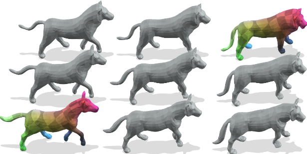

{{ page.authors }}

## Abstract

> Although 3D shape matching and interpolation are highly interrelated, they are often studied separately and applied sequentially to relate different 3D shapes, thus resulting in sub-optimal performance. In this work we present a unified framework to predict both point-wise correspondences and shape interpolation between 3D shapes. To this end, we combine the deep functional map framework with classical surface deformation models to map shapes in both spectral and spatial domains. On the one hand, by incorporating spatial maps, our method obtains more accurate and smooth point-wise correspondences compared to previous functional map methods for shape matching. On the other hand, by introducing spectral maps, our method gets rid of commonly used but computationally expensive geodesic distance constraints that are only valid for near-isometric shape deformations. Furthermore, we propose a novel test-time adaptation scheme to capture both pose-dominant and shape-dominant deformations. Using different challenging datasets, we demonstrate that our method outperforms previous state-of-the-art methods for both shape matching and interpolation, even compared to supervised approaches.

## Resources

<a href=" {{ page.paperurl }} ">[pdf]</a> <a href=" {{ page.arxiv }} ">[arxiv]</a> <a href=" {{ page.code }} ">[github]</a> <a href=" {{ page.pageurl }} ">[project page]</a> <a href=" {{ page.video }} ">[video]</a> <a href=" {{ page.poster }} ">[poster]</a>

## Bibtex

    @InProceedings{Cao_2024_CVPR,
        author    = {Dongliang Cao, Marvin Eisenberger, Nafie El Amrani, Daniel Cremers, Florian Bernard},
        title     = {Spectral Meets Spatial: Harmonising 3D Shape Matching and Interpolation},
        booktitle = {Proceedings of the IEEE/CVF Conference on Computer Vision and Pattern Recognition (CVPR)},
        month     = {June},
        year      = {2024}
    }  
