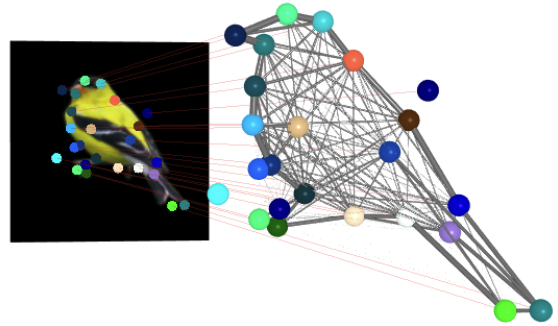

{{ page.authors }}

## Abstract

> Understanding 3D object structure from image collections of general object categories remains a long-standing challenge in computer vision. Due to the high relevance of image keypoints (e.g. for graph matching, controlling generative models, scene understanding, etc.), in this work we specifically focus on inferring 3D structure in terms of sparse keypoints. Existing 3D keypoint inference approaches rely on strong priors, such as spatio-temporal consistency, multi-view images of the same object, 3D shape priors (e.g. templates, skeleton), or supervisory signals e.g. in the form of 2D keypoint annotations. In contrast, we propose the first unsupervised 3D keypoint inference approach that can be trained for general object categories solely from an inhomogeneous image collection (containing different instances of objects from the same category). Our experiments show that our method not only improves upon unsupervised 2D keypoint inference, but more importantly, it also produces reasonable 3D structure for various object categories, both qualitatively and quantitatively.

## Resources

<a href=" {{ page.paperurl }} ">[pdf]</a> <a href=" {{ page.arxiv }} ">[arxiv]</a> <a href=" {{ page.code }} ">[github]</a> <a href=" {{ page.pageurl }} ">[project page]</a> <a href=" {{ page.video }} ">[video]</a> <a href=" {{ page.poster }} ">[poster]</a>

## Bibtex

    @InProceedings{Wang_2024_CVPR,
        author    = {Weikang Wang, Dongliang Cao, Florian Bernard},
        title     = {Unsupervised 3D Structure Inference from Category-Specific Image Collections},
        booktitle = {Proceedings of the IEEE/CVF Conference on Computer Vision and Pattern Recognition (CVPR)},
        month     = {June},
        year      = {2024}
    }  
