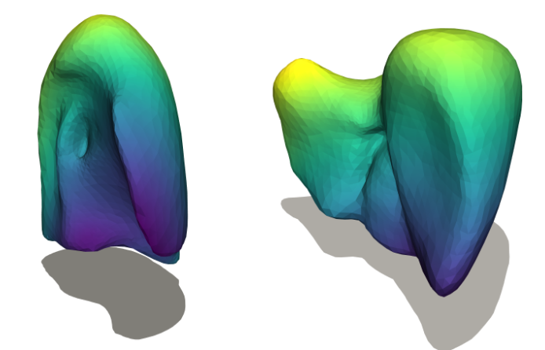

{{ page.authors }}

## Abstract

> We introduce a novel unsupervised deep learning framework for constructing statistical shape models (SSMs). Although unsupervised learning-based 3D shape matching methods have made a major leap forward in recent years, the correspondence quality of existing methods does not meet the demanding requirements necessary for the construction of SSMs of complex anatomical structures. We address this shortcoming by proposing a novel deformation coherency loss to effectively enforce smooth and high-quality correspondences during neural network training. We demonstrate that our framework outperforms existing methods in creating high-quality SSMs by conducting extensive experiments on five challenging datasets with varying anatomical complexities. Our proposed method sets the new state of the art in unsupervised SSM learning, offering a universal solution that is both flexible and reliable.
## Resources

<a href=" {{ page.paperurl }} ">[pdf]</a> <a href=" {{ page.arxiv }} ">[arxiv]</a> <a href=" {{ page.code }} ">[github]</a> <a href=" {{ page.pageurl }} ">[project page]</a> <a href=" {{ page.video }} ">[video]</a> <a href=" {{ page.poster }} ">[poster]</a>

<!-- ## Bibtex

    @InProceedings{Cao_2024_CVPR,
        author    = {Dongliang Cao, Marvin Eisenberger, Nafie El Amrani, Daniel Cremers, Florian Bernard},
        title     = {Spectral Meets Spatial: Harmonising 3D Shape Matching and Interpolation},
        booktitle = {Proceedings of the IEEE/CVF Conference on Computer Vision and Pattern Recognition (CVPR)},
        month     = {June},
        year      = {2024}
    }   -->
